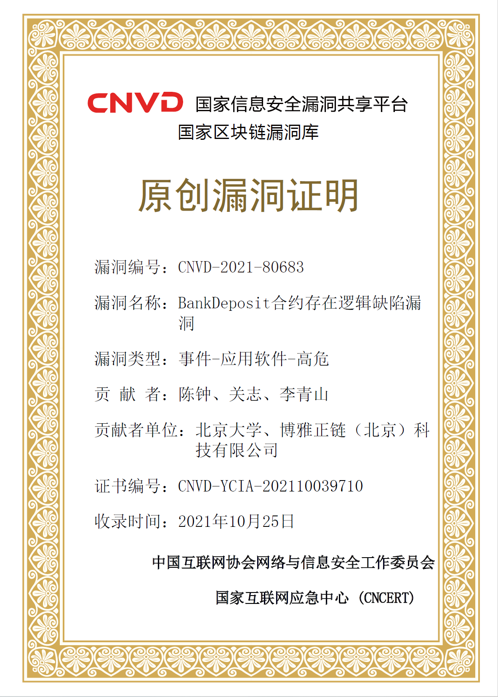
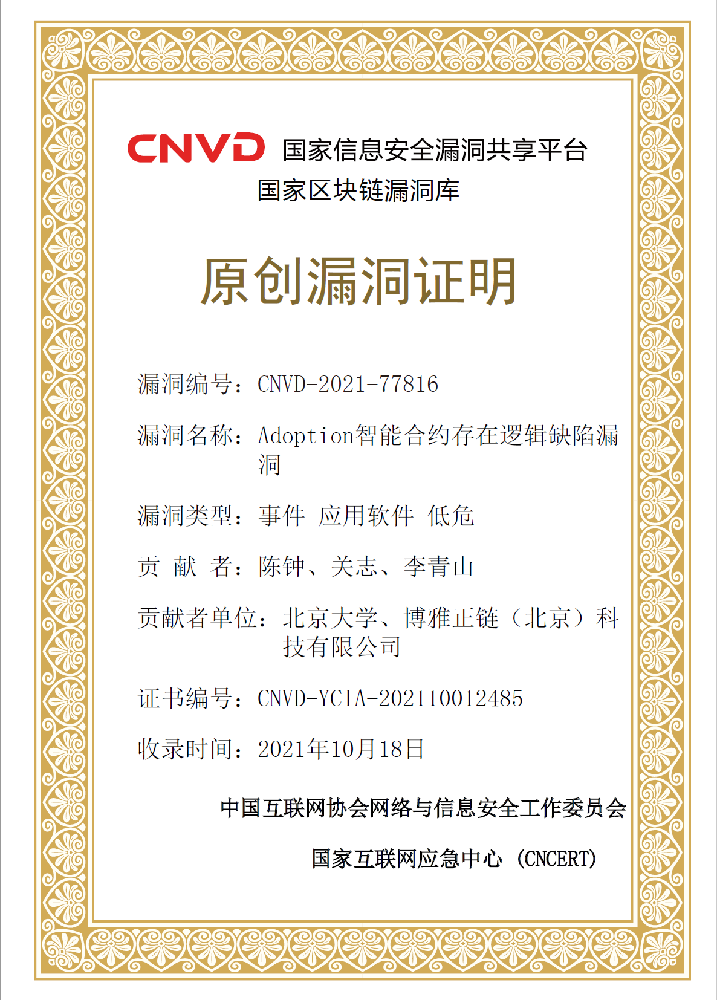
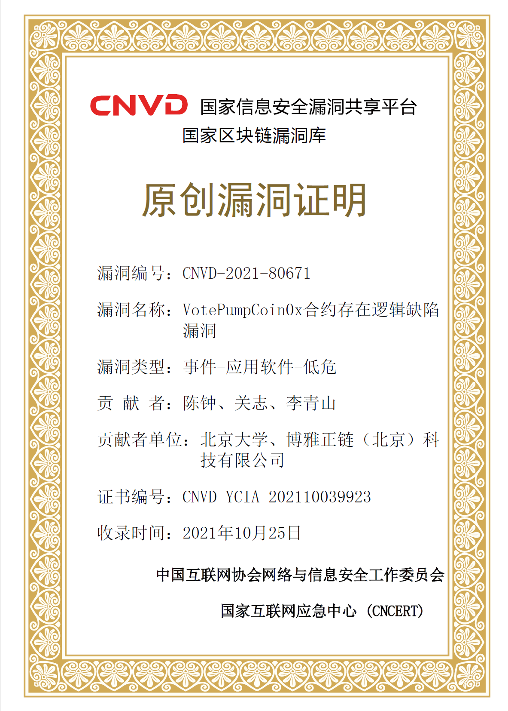
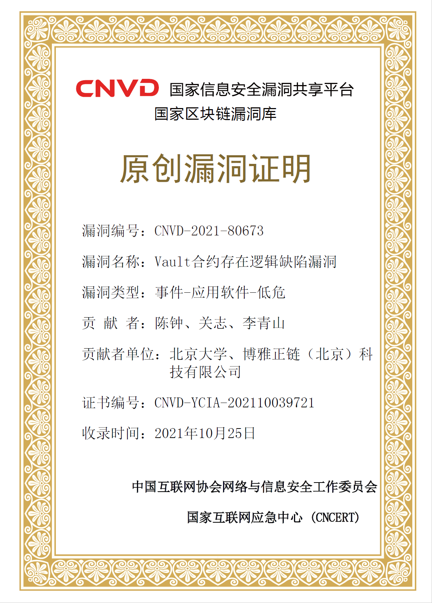
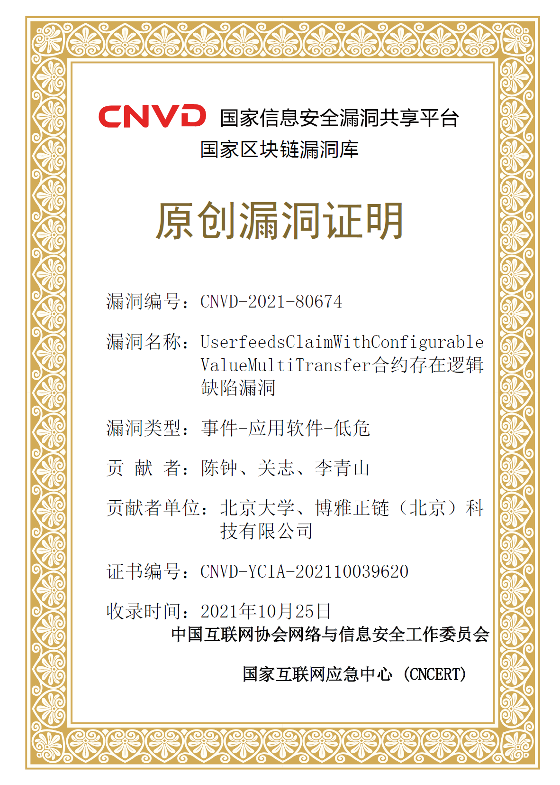
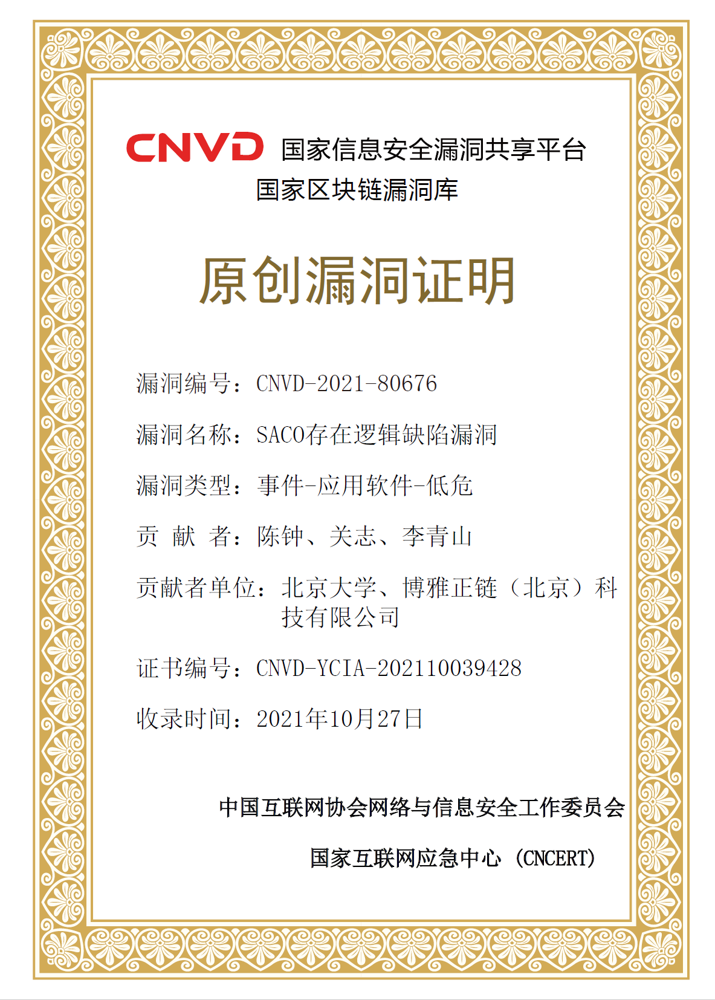
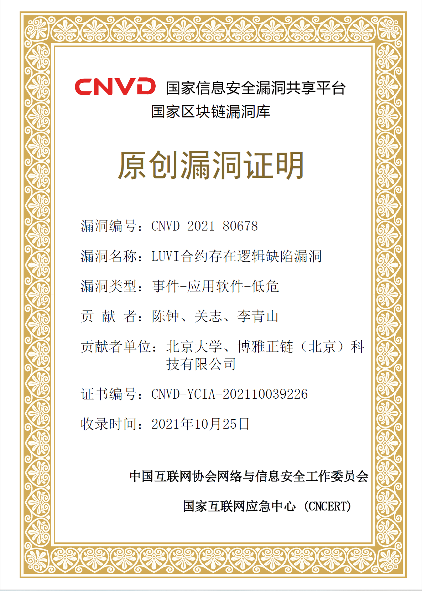
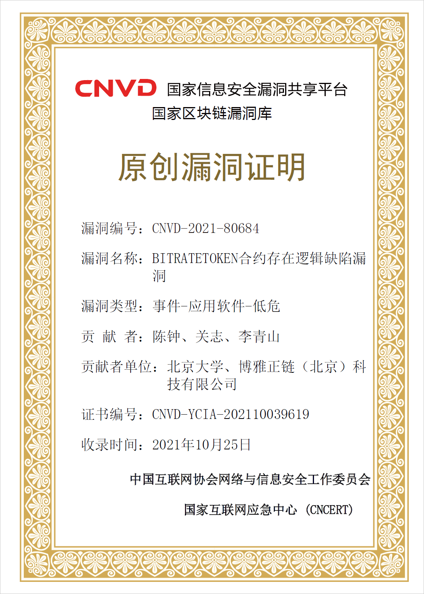

# 智能合约安全审计服务介绍

by. 北京大学信息安全实验室

## 项目简介  

&emsp;&emsp;传统软件漏洞检测技术难以支持区块链智能合约的安全审计，无法识别由于智能合约语义错误或漏洞导致的安全风险和合约交易损失。  
&emsp;&emsp;本项目重点研究智能合约安全审计问题，涉及基于污点分析技术的已知智能合约漏洞检测、基于深度学习及语义分析技术的未知智能合约漏洞挖掘，和适用于组合交易的智能合约形式化验证方法。突破现有智能合约在漏洞检测、漏洞挖掘、功能验证技术在分析精度、处理规模和应用场景上的局限性。  
&emsp;&emsp;目前，本项目团队基于上述关键技术的研究工作已取得多项专利及论文成果并发现以太坊平台多个中高危智能合约零日漏洞。基于该理论框架实现的智能合约安全审计工具集，有效实现对合约安全风险的检测、定位、异常诊断功能，为保障高并发环境下智能合约的可信、可靠提供理论基础和技术支撑。

### 
智能合约漏洞检测

&emsp;&emsp;本项目支持针对Ethereum系统solidity智能合约和Hyperledger Fabric系统Go链码的已知安全漏洞的检测和定位。用户上传智能合约文件，系统返回的检测报告，包含漏洞类型、所在位置、漏洞描述及修改建议。

#### 针对solidity智能合约

覆盖漏洞如下：

|  序号  |  漏洞名称  |  说明  |
|:-------------|:------------------|:------|
|  1  |  溢出  |  未受保护的数值计算  |
|  2  |  重入  |  函数内和函数间重入攻击  |
|  3  |  交易顺序依赖  |  frontrunning相关攻击   |
|  4  |  时间戳依赖  |  与交易时间相关的攻击  |
|  5  |  拒绝服务  |  通过意外回滚或gaslimit导致的拒绝服务  |
|  6  |  权限管理  |  因逻辑缺陷导致的权限丢失等安全问题  |

* 有关上述漏洞的详细介绍及漏洞合约数据集参见[链接](https://swcregistry.io/)
* 有关该检测工具的更多介绍参见[链接](https://github.com/Jianbo-Gao/EasyFlow)。

#### 针对Go链码

覆盖漏洞如下：

|  序号  |  漏洞名称  |  说明  |
|:-------------|:------------------|:------|
| 1 | 全局变量及字段声明 | 不同节点中全局变量和字段值可能不同 |
| 2 | 随机数与时间戳依赖 | 执行路径及结果不应依赖随机数和时间戳 |
| 3 | range over map | 读取键值顺序随机，可能会导致结果不确定 |
| 4 | gorountine | 链码中不鼓励使用并发 |
| 5 | 区块链引入的不确定性 | web服务，系统命令，外部文件访问，第三方库 |
| 6 | 幻影读 | 部分查询函数返回的结果不能用于更新账本 |
| 7 | 跨通道链码调用 | 不能通过调用其他通道上的链码提交数据 |
| 8 | 写后读 | 不能在同一个交易中更新并读取同一个key值 |
| 9 | 隐私泄露 | 隐私数据不应影响链码执行路径，不应作为方法返回值 |
| 10 | 溢出 | 未受保护的数值计算 |

* 有关上述漏洞的合约数据集参见[链接](https://github.com/my-code-cloud/llvmPass/tree/main/myPass/tracker1.0)
* 有关该检测工具的更多介绍参见[链接](https://github.com/my-code-cloud/llvmPass/tree/main/myPass/tracker1.0)。

### 
智能合约形式化验证

* 功能说明
* 用法说明
* 工具链接及案例

### 
智能合约未知漏洞挖掘

* 功能说明
* 用法说明
* 工具链接及案例

## 团队成果展示

### 
论文成果

&emsp;&emsp;在区块链领域国内外知名会议/期刊累计发表论文37篇。

|  年份  |  论文名称  |  发表刊物  |
|:-------------|:------------------|:------|
|2022	|Smifier: A Smart Contract Verifier for Composite Transactions	|SEKE|
|2022	|RegLang:一种面向监管的智能合约编程语言	|计算机科学|
|2022	|基于区块链的无证书签密方案	|计算机与现代化|
|2021	|FASTBLOCK: Accelerating Blockchains via Hardware Transactional Memory	|ICDCS|
|2021	|TrustCross : Enabling Confidential Interoperability across Blockchains Using Trusted Hardware	|ICBTA| 
|2021	|应用区块链的多接收者多消息签密方案	|软件学报|
|2021	|群智感知中基于区块链的带时效签密方案	|计算机学报|
|2021	|区块链数据安全服务综述	|软件学报|
|2021	|TBFT: Efficient Byzantine Fault Tolerance Using Trusted Execution Environment	|ICC|
|2021	|Blockchain-based Multi-recipient Multi-message Signcryption Scheme	|Journal of Software|
|2021	|数字货币的安全和发展	|中国信息安全|
|2021	|基于区块链的学历证书可信认证系统	|计算机时代|
|2020	|Kaya: A Testing Framework for Blockchain-based Decentralized Applications	|ICSME|
|2020	|Studying gas exceptions in blockchain-based cloud applications	|Journal of Cloud Computing|
|2020	|EShield: Protect Smart Contracts against Reverse Engineering	|ISSTA|
|2020	|Mining DApp Repositories: Towards In-Depth Comprehension and Accurate Classification	|SEKE|
|2020	|智能合约安全漏洞检测技术研究	|保密科学技术|
|2020	|区块链隐私保护技术综述	|保密科学技术|
|2020	|智能合约及基础软硬件安全解读	|金融电子化|
|2020	|基于中国剩余定理的区块链投票场景签名方案	|计算机应用研究|
|2020	|区块链性能扩展与安全研究	|信息网络安全|
|2019	|EasyFlow: keep ethereum away from overflow	|ICSE|
|2019	|Guided, automated testing of blockchain-based decentralized applications	|ICSE|
|2019	|Towards Automated Migration for Blockchain-based Decentralized Application	|ICPC|
|2019	|Understanding Out of Gas Exceptions on Ethereum	|BlockSys|
|2019	|Performance Analysis of the Libra Blockchain: An Experimental Study |HotICN|
|2019	|国产密码体系在区块链中的应用与挑战	|中国信息安全|
|2019	|区块链在政务服务与监管科技领域的应用、挑战与创新	|软件和集成电路|
|2019	|AuthLedger: A Novel Blockchain-based Domain Name Authentication Scheme	|ICISSP|
|2019	|Towards automated testing of blockchain-based decentralized applications	|ICPC|
|2019	|Finding concurrency exploits on smart contracts	|ICSE Companion|
|2018	|Reguard: finding reentrancy bugs in smart contracts	|ICSE Companion|
|2018	|S-gram: towards semantic-aware security auditing for Ethereum smart contracts	|ASE|
|2018	|EClone: detect semantic clones in Ethereum via symbolic transaction sketch	|ESEC/FSE|
|2018	|Analysis of Man-In-The-Middle of Attack on Bitcoin Address	|ICETE|
|2018	|一种整数上的PACDP全同态加密改进	|控制工程|
|2016	|加密数据上的计算密码学技术研究综述	|计算机应用研究|

### 专利成果

&emsp;&emsp;在区块链领域累计申请专利16项，其中授权专利7项。

|  专利状态  |  公开年份  |  专利名称  |  专利号/申请号  |
|:-------|:-------|:------|:------|
|申请专利	|2022	|一种Fabric区块链系统智能合约的安全分析检测方法	|CN202210029433.4|
|申请专利	|2021	|一种基于区块链的数字函证平台及方法	|CN202110171263.9|
|申请专利	|2020	|一种智能合约安全增强方法	|CN202010211696.8|
|申请专利	|2020	|一种针对智能合约行为的监管方法	|CN202010211697.2|
|申请专利	|2020	|一种基于共识参与度和交易活跃度的改进PBFT共识方法	|CN202011152332.3|
|申请专利	|2020	|一种区块链分片的高效存储重配置方法	|CN202011152333.8|
|申请专利	|2020	|面向大数据架构与区块链的多源数据处理方法及装置	|CN202010978288.5|
|申请专利	|2020	|基于智能合约与工作流架构的执法返还系统及方法	|CN202010979863.3|
|申请专利	|2020	|基于区块链的垂直电商交易平台	|CN202011022370.7|
|授权专利	|2022	|基于深度学习的以太坊智能合约安全漏洞检测方法与系统	|CN202210029518.2|
|授权专利	|2022	|一种适用于组合交易的智能合约形式化验证方法及系统	|CN202210029440.4|
|授权专利	|2018	|一种SM2公钥密码的数字签名快速生成方法	|CN201811323155.3|
|授权专利	|2018	|一种两方SM2数字签名生成方法	|CN201811381814.9|
|授权专利	|2018	|SM3密码杂凑算法的并行化优化方法	|CN201811323148.3|
|授权专利	|2016	|基于组合公钥的密码学货币地址在线生成方法	|CN201610938140.2|
|授权专利	|2012	|一种抵御冷启动攻击的公钥密码实现方法	|CN201210171306.4|

### 零日漏洞

&emsp;&emsp;累计在以太坊平台发现15个智能合约零日漏洞，含多个中危、高危漏洞。

